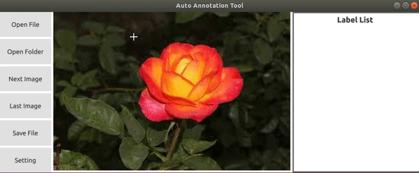
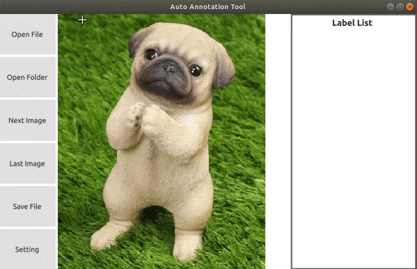

# AutoAnnotationTool
A label tool enable to do image annotation for rectangle and generate polygon annotation automatically
 
## Environment
### Compiler: 
|Win 10|Ubuntu 1804|
|:--:|:--:|
|Visual studio 2017|GCC 7.5.0|  

### Third Party: 
|Package|Version|
|:--:|:--:|
|Qt| 5.14.2|  
|OpenCV| 3.4.9|  

## Description
AutoAnnotationTool is a graphical image annotation tool, 
it aim to reduce semantic segmentation label time.
For now, the feature list below have been implement 
and more function will be added continuously.
It is written in c++ and Qt for its graphical interface,
and this project is inspired by https://github.com/wkentaro/labelme

## Feature
- Rectangle annotation
- Generate a polygon annotation automatically with rectangle ROI and enable to modify the generated polygon

  
- Save rectangle and polygon annotation data according to the [labelme](https://github.com/wkentaro/labelme) json format

## RoadMap
- Load exist annotation from json file
- Algorithm parameter setting window
- Implement more image segmentation algorithm
- CICD
  - I have no experience on CICD, if anyone is willing to help on this, it would be great help to me

## How to contribute
- I am open to any suggestions.
- For questions, you can create an issue
- Send pull requests for code changes
