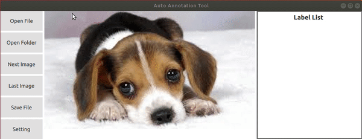
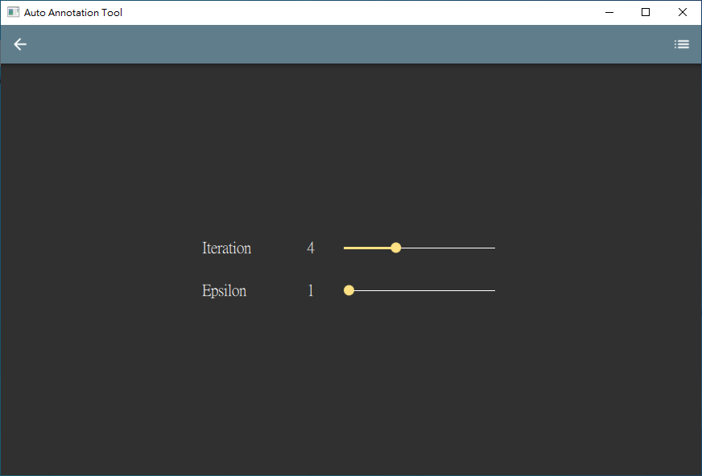

# AutoAnnotationTool
A label tool enable to do image annotation for rectangle and generate polygon annotation automatically
 
## Environment
### Compiler: 
|Win 10|Ubuntu 1804|
|:--:|:--:|
|Visual studio 2017|GCC 7.5.0|  

### Third Party: 
|Package|Version|
|:--:|:--:|
|Qt| 5.14.2|  
|OpenCV| 3.4.9|  

# How to use (for Ubuntu)
- Download AutoAnnotationInstaller.run from release package
- Follow the Instructions to install
- Open terminal and change directory to installation folder
- Execute the followng command
```
$ ./AppRun
```

## Description
AutoAnnotationTool is a graphical image annotation tool, 
I start this project for saving my time spent on semantic segmentation label.
For now, the feature list below have been implement 
and more function will be added continuously.
It is written in c++ and Qt for its graphical interface,
and this project is inspired by https://github.com/wkentaro/labelme

## Feature
- Rectangle annotation
- Generate a polygon annotation with just one click on a rectangle ROI

 
  
 
- Save and load rectangle and polygon annotation data according to the [labelme](https://github.com/wkentaro/labelme) json format

## Description to setting parameter
- Iteration: Number of iterations the algorithm should run.(default = 4)
- Epsilon: Input for OpenCV approxPolyDP () function (default = 1) [detail](https://www.programmersought.com/article/1309195733/)

## RoadMap
- Implement more image segmentation algorithm
- CI
  - I have no experience on CI, if anyone is willing to help on this, it would be great help to me

## How to contribute
- I am open to any suggestions.
- For questions, you can create an issue
- Send pull requests for code changes