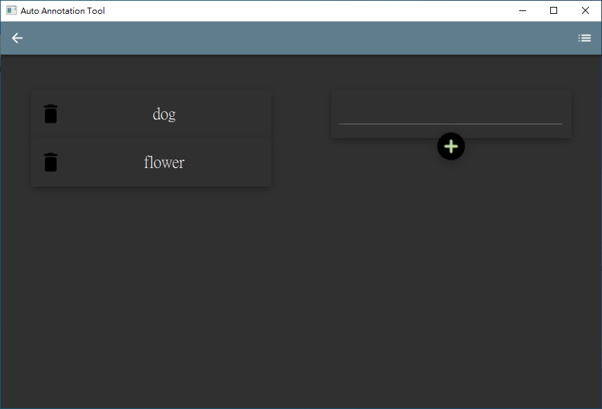

# AutoAnnotationTool
A label tool enable to do image annotation for rectangle and generate polygon annotation automatically
 
## Environment
### Compiler: 
|Win 10|Ubuntu 20.04|
|:--:|:--:|
|Visual studio 2022|GCC 9.4|  

### Third Party: 
|Package|Version|
|:--:|:--:|
|Qt| 5.14.2|  
|OpenCV| 3.4.15|  

# How to use (for Ubuntu)
- Download AutoAnnotationInstaller.run from release package
- Follow the Instructions to install
- Open terminal and change directory to installation folder
- Execute the followng command
```
$ ./AppRun
```

# How to build
1. Clone this project with submodule
    ```
    git clone https://github.com/andywang0607/AutoAnnotationTool.git --recursive
    or 
    git clone git@github.com:andywang0607/AutoAnnotationTool.git --recursive
    ```

2. Build this project
    - Open QtCreator
    - Click build button

## Description
AutoAnnotationTool is a graphical image annotation tool, 
I start this project for saving my time spent on semantic segmentation label.
For now, the feature list below have been implement 
and more function will be added continuously.
It is written in c++ and Qt for its graphical interface,
and this project is inspired by https://github.com/wkentaro/labelme

## Feature
- Rectangle annotation
  - Modify rectangle by simply drag the coner or edge of it is supported 
- Polygon annotation
  - Generate a polygon annotation with just one click on a rectangle ROI
  - Modify the generated polygon by dragging it is supported
- Edit Label  
- Save and load rectangle and polygon annotation data according to the [labelme](https://github.com/wkentaro/labelme) json format


  
 

## ShortCut
- A: Last image
- D: Next image
- S: Save
- Space: Open label list

## Description to setting parameter
- Iteration: Number of iterations the algorithm should run.(default = 4)
- Epsilon: Input for OpenCV approxPolyDP () function (default = 1) [detail](https://www.programmersought.com/article/1309195733/)


## How to contribute
- I am open to any suggestions.
- For questions, you can create an issue
- Send pull requests for code changes